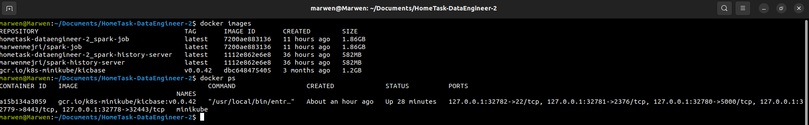
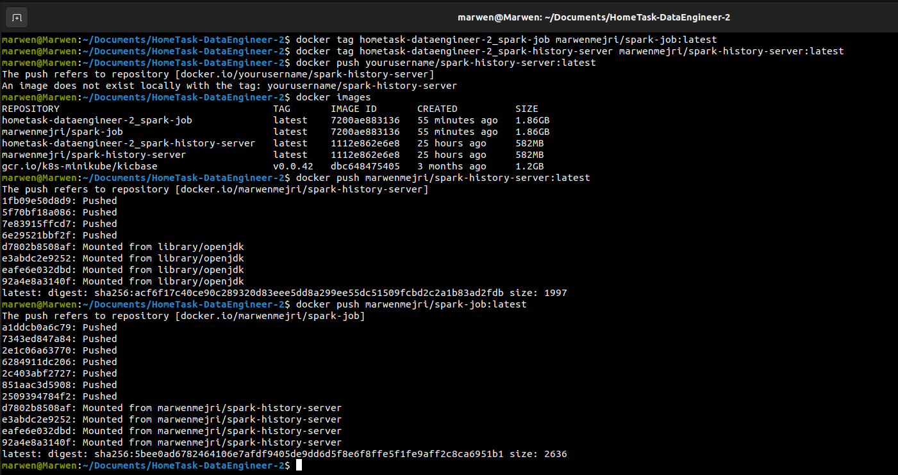
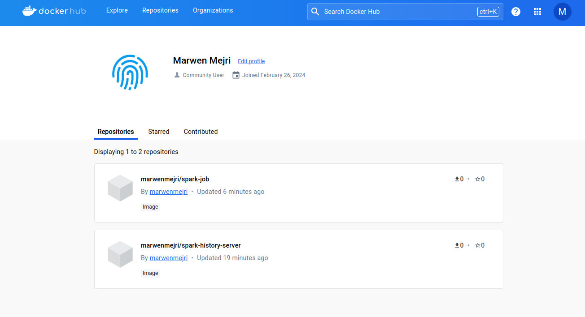
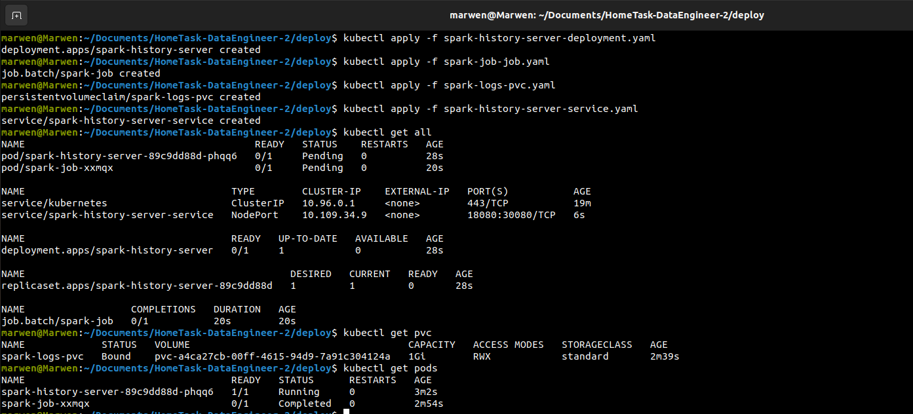
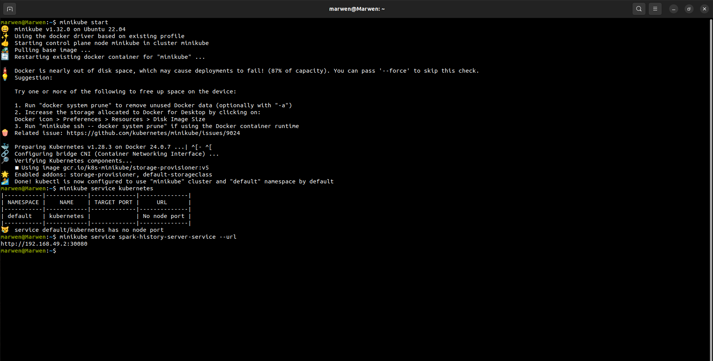
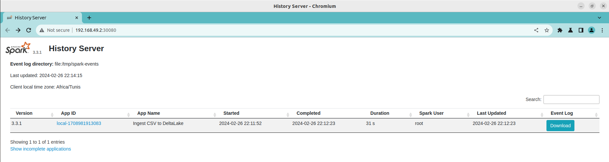
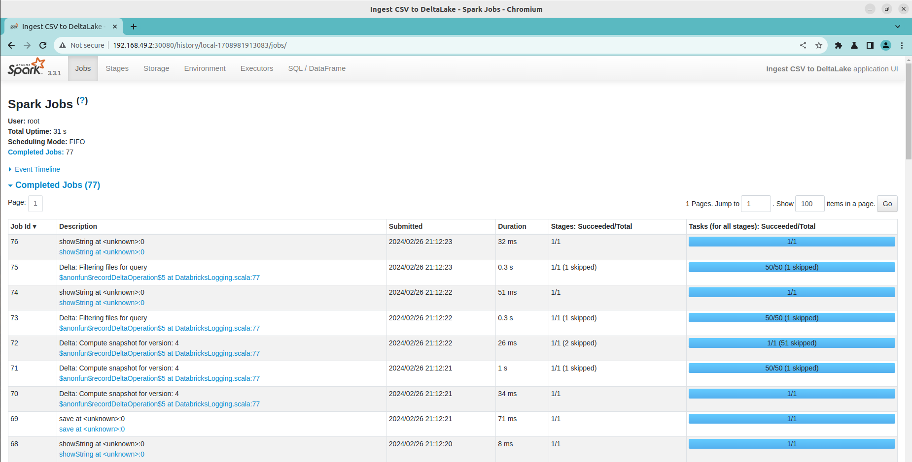
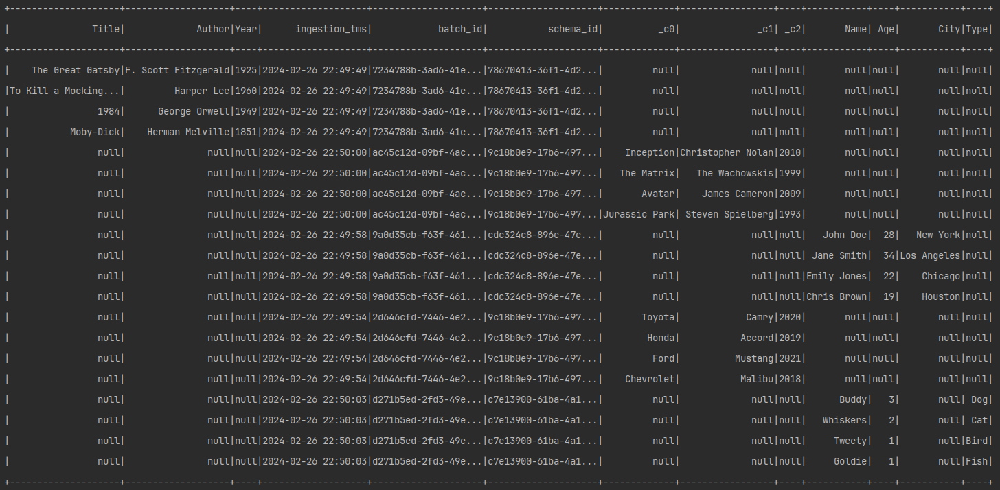
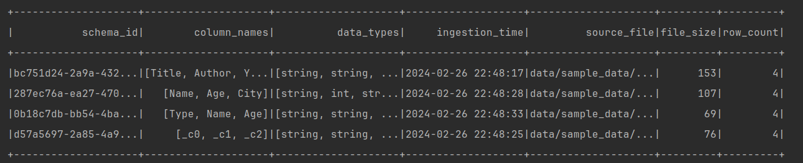

# Spark on Kubernetes Project

This project demonstrates how to deploy Spark jobs on Kubernetes, including setting up a Spark History Server to visualize logs.

## Overview

This project includes Docker configurations for a Spark job and the Spark History Server, along with Kubernetes deployment configurations for running everything on Minikube.

The project involves several key components and requirements:

1. **Spark Job Design and Implementation**:
   - A Spark job that ingests one or multiple CSV files into DeltaLake.
   - The job handles files with and without headers and adds two extra columns to the output DataFrame:
     - `ingestion_tms`: Ingestion timestamp with the format `YYYY-MM-DD HH:mm:SS`.
     - `batch_id`: A UUID v4 identifier.
   - It uses the APPEND write mode to atomically add new data to the Delta table.

2. **Docker and Docker Compose Configuration**:
   - Creation of a Docker Compose YAML file to run the Spark job from a container.
   - Integration of the Spark History Server in the service, with a custom Dockerfile created due to the unavailability of the specified image (`gcr.io/spark-operator/spark:v2.4.0`).

3. **System Design for Deployment**:
   - The solution includes a production-ready system design, deployable on Kubernetes or a public cloud provider (AWS/GCP/Azure), with job orchestration.

### Implicit Requirements

- Development is done using Python3 with PySpark 3.3.1.
- DeltaLake version 1.2.1 is used, with flexibility in the choice of storage provider.
- Emphasis on high-quality code production.
- Spark job logs and traces are made persistent and accessible from the Spark History Server.
- The solution includes tests that can be run locally.
- The project adheres to the principle of using common sense in its implementation.

### Custom Spark History Server Image

Due to the unavailability of the mentioned Spark History Server image, a custom Dockerfile was created based on Java, with Spark installed on top of it. This approach ensures that the Spark History Server is fully functional and integrated into the deployment pipeline.

This project includes Docker configurations for a Spark job and the Spark History Server, along with Kubernetes deployment configurations for running everything on Minikube.
## Prerequisites

- Docker
- Minikube
- kubectl

## Setup

### Step 1: Building Docker Images & Push to Docker Registry

Build the Docker images for the Spark job and Spark History Server:

```sh
    docker build -f Dockerfile-spark-job -t marwenmejri/spark-job:latest .
    docker build -f Dockerfile-spark-history-server -t marwenmejri/spark-history-server:latest .
```



Push these Docker images to DockerHub (I pushed the images publicly so no need to execute this step)





### Step 2: Starting Minikube
Start Minikube to use as the Kubernetes cluster:

```sh
    minikube start
```

### Step 3: Deploying to Kubernetes
Deploy the Spark job, Spark History Server, and necessary Kubernetes resources:

```sh
    kubectl apply -f deploy/spark-job-job.yaml
    kubectl apply -f deploy/spark-history-server-deployment.yaml
    kubectl apply -f deploy/spark-logs-pvc.yaml
    kubectl apply -f deploy/spark-history-server-service.yaml
```



## Accessing the Spark History Server
Retrieve the URL for the Spark History Server UI:

```sh
    minikube service spark-history-server-service --url
```



Open the URL in a web browser to view the Spark job logs.





Here Are the 2 created delta-tables : 
1. **csv_data :**



2. **metadata :**



## Cleaning Up
To stop and delete Minikube:

```sh
    minikube stop
    minikube delete
```

To remove Kubernetes resources:

```sh
    kubectl delete -f deploy/
```

## Authors
Marwen Mejri - Data Engineer - https://github.com/marwenmejri